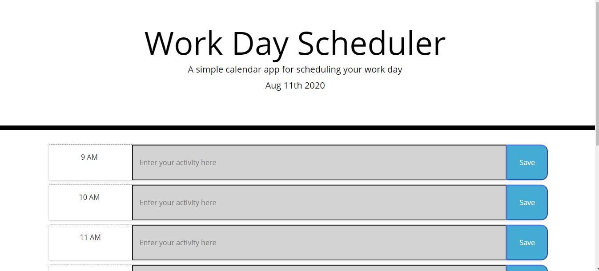

# 5-day-planner

Deployed link: https://adgrossm.github.io/5-day-planner/

A simple calendar application for scheduling out your day! Type your tasks into the daily schedule and click the save button in the right column to save them to local storage. After that, your tasks will be waiting for you whenever you visit the page again! 

Technologies Used
- JQuery
- moment.js
- javascript
- Bootstrap
- HTML
- CSS
- Git
- GitHub
